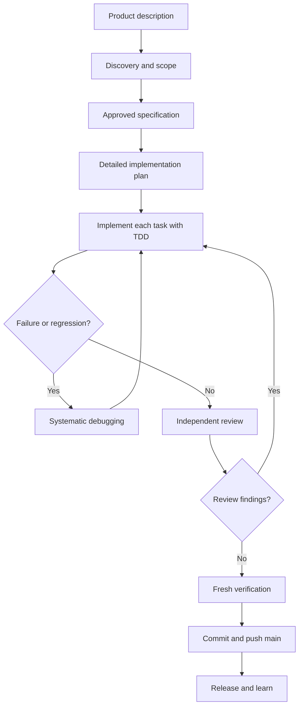

# Solo Codex Software Production Workflow with Superpowers

This is a complete, repeatable workflow for one developer taking a product description through release using Codex with the [Superpowers](https://github.com/obra/superpowers) skill set. It turns ambiguous requests into a reviewed specification, a testable implementation plan, working code, and verified production delivery.

> **Repository rule:** This project requires completed work to be committed and pushed directly to `main`. That requirement overrides Superpowers' usual `using-git-worktrees` branch workflow. Do not create a feature branch or worktree here.

## Operating principles

- Do not write product code before the desired outcome, scope, and acceptance criteria are understood.
- Treat the specification as the agreement about *what* to build; treat the implementation plan as the agreement about *how* to build it.
- Use test-driven development: observe a failing test, write the smallest passing implementation, then refactor.
- Treat observed failures as evidence. Diagnose before changing code.
- Do not claim completion without fresh verification output.
- Keep changes focused. New requirements start a new specification cycle rather than expanding an active task silently.

## Lifecycle at a glance



## 1. Capture the product description

**Goal:** Turn a request into a short, observable problem statement before discussing solutions.

Write down:

- Who has the problem and the outcome they need.
- The current pain or opportunity.
- The smallest useful product change.
- Business or user success measures.
- Constraints: deadline, compatibility, budget, security, performance, and non-goals.

**Codex prompt:**

```text
I want to build [brief product description]. Use superpowers:brainstorming.
Help me define the user, problem, desired outcome, constraints, non-goals,
and measurable acceptance criteria before proposing an implementation.
```

**Exit criteria:** A concise product brief exists. It identifies the user, problem, desired outcome, constraints, and success measure. It must not prescribe an implementation without a reason.

## 2. Discover, narrow scope, and write the specification

**Primary skill:** `superpowers:brainstorming`

Superpowers uses a Socratic design process rather than jumping to code. Codex should inspect relevant project context, ask one clarifying question at a time, offer alternatives with trade-offs, and present the design in reviewable sections. The developer approves the design before implementation work begins.

For a change that spans independent systems, split it into separately valuable specifications. For example, do not combine a new billing system, analytics pipeline, and UI redesign into one plan merely because they share a launch date.

The specification should cover:

- User stories and explicit non-goals.
- Functional requirements and acceptance criteria.
- Architecture and component boundaries.
- Data model, interfaces, and external dependencies.
- Failure behaviour, security/privacy considerations, and observability.
- Test strategy and release/rollback requirements.

**Codex prompt:**

```text
Use superpowers:brainstorming to turn the approved product brief into a
specification. Inspect the repository first. Ask one question at a time,
propose alternatives with trade-offs, and wait for my approval before writing
the spec. Save the approved spec under superpowers/.
```

**Exit criteria:** The specification is written, self-reviewed for ambiguity and contradictions, committed to `main`, and explicitly approved by the developer.

## 3. Convert the specification into an implementation plan

**Primary skill:** `superpowers:writing-plans`

The plan is an executable engineering document, not a high-level checklist. It assumes the implementer has no repository context. Every task should be independently reviewable and produce a working, testable increment.

For each task, record:

- Exact files to create, modify, and test.
- Interfaces consumed from earlier tasks and produced for later tasks.
- The failing test to write first.
- The exact command that proves the test fails for the intended reason.
- The smallest implementation needed to make it pass.
- The command that proves it passes.
- The focused commit to create after the task.

Avoid placeholders such as “add validation” or “write tests.” Write the actual expected behavior and test cases. Apply YAGNI: the plan should implement the approved scope only.

**Codex prompt:**

```text
Use superpowers:writing-plans for the approved specification at
[path]. Create a task-by-task TDD implementation plan in
superpowers/plans/. Include exact paths, interfaces, test code, commands,
expected results, and commit boundaries. Do not implement the plan yet.
```

**Exit criteria:** The plan covers every specification requirement, has no placeholders, is internally consistent, and the developer chooses an execution mode.

## 4. Choose how to execute the plan

Select one mode deliberately. The plan stays authoritative in both cases.

| Situation | Skill | How it works |
| --- | --- | --- |
| Several clear, independent tasks; rapid autonomous execution is useful | `superpowers:subagent-driven-development` | Codex dispatches a fresh worker per task and performs two gates: specification compliance, then code-quality review. |
| You want to work through batches and inspect results at planned checkpoints | `superpowers:executing-plans` | Codex executes the written plan inline, reports progress after each batch, and waits at review checkpoints. |
| The work has genuinely independent research or implementation streams | `superpowers:dispatching-parallel-agents` | Parallelize only the independent streams; integrate through the approved plan. |

For this repository, all execution modes commit completed focused changes and push them directly to `main`. Do not use `using-git-worktrees`, because it conflicts with the repository's direct-to-`main` policy.

**Codex prompt:**

```text
Implement superpowers/plans/[plan].md using
superpowers:subagent-driven-development. Follow the plan task by task, keep
changes in scope, commit each completed task, and push directly to main.
```

**Exit criteria:** The chosen execution mode is explicit, the test baseline is known, and work begins only from the approved plan.

## 5. Implement every task with TDD

**Primary skill:** `superpowers:test-driven-development`

Use the same loop for every behavior:

1. Write one focused test for the next requirement.
2. Run it and confirm that it fails because the behavior is missing or incorrect.
3. Implement the minimum code to make that test pass.
4. Run the focused test and then the relevant regression suite.
5. Refactor only while all tests remain green.
6. Commit the completed task with a concise message, then push `main`.

Do not rationalize skipping the failing-test step for “small” changes. If production code was written before its test, delete or revert it and restart from the failing test unless an existing test already specifies the behavior.

**Codex prompt:**

```text
For Task [N] in the approved plan, use superpowers:test-driven-development.
Show the failing test result, implement only enough code to pass it, run the
focused and relevant regression tests, then commit and push the completed task
to main.
```

**Exit criteria:** Each task’s acceptance tests pass, changes match the plan, and the commit history makes the task boundaries understandable.

## 6. Debug failures systematically

**Primary skill:** `superpowers:systematic-debugging`

Unexpected behavior, flaky tests, CI failures, and production defects are not invitations to guess. First preserve the evidence and make the failure reproducible. Then trace the failure to its root cause, identify why the system permitted it, and add the smallest complete fix.

Use this sequence:

1. Record the symptom, environment, command, input, and expected versus actual result.
2. Reproduce the failure reliably or state what prevents reproduction.
3. Inspect the causal chain rather than editing the line where the error surfaced.
4. Write a regression test that fails for the root cause.
5. Fix the root cause and add a proportionate defense where the bad state enters the system.
6. Re-run the original reproduction command and affected test suite.

**Codex prompt:**

```text
This failure occurred: [error, command, expected behavior, actual behavior].
Use superpowers:systematic-debugging. Reproduce it, trace the root cause, add a
regression test, and do not propose code changes until the evidence supports a
cause.
```

**Exit criteria:** A root-cause explanation exists, a regression test protects against recurrence, and original evidence now verifies the fix.

## 7. Review before integration or release

**Primary skills:** `superpowers:requesting-code-review` and `superpowers:receiving-code-review`

Before declaring the feature complete, ask for a review against the approved specification and implementation plan. The review should identify issues by severity. Critical issues stop progress; lower-severity findings must be explicitly accepted, fixed, or deferred with a tracked reason.

When receiving feedback, validate each claim against code, tests, documentation, and the requirements. Do not implement comments mechanically; correct feedback should result in a focused fix and test, while incorrect feedback should receive an evidence-based response.

**Codex prompt:**

```text
Use superpowers:requesting-code-review for the changes implementing [feature].
Review against the approved spec and plan. Report findings by severity with
file and line references, and block completion on critical findings.
```

**Exit criteria:** No unresolved critical review findings remain. The code, tests, and documentation still match the approved scope.

## 8. Verify, deliver, and release

**Primary skill:** `superpowers:verification-before-completion`

Run fresh verification after the last code or documentation change. Do not rely on an earlier green run. At minimum, run the complete relevant automated suite, lint/type checks, build, and manual acceptance checks specified in the plan. Check the working tree and commit history to ensure only intended files changed.

Then commit the final work and push directly to `main`:

```powershell
git status --short
git add [intended paths]
git commit -m "feat: [concise completed outcome]"
git push origin main
```

If the application has a deployment stage, verify the deployed version with the same acceptance criteria used locally. Record the release identifier, validation result, and rollback trigger.

**Codex prompt:**

```text
Use superpowers:verification-before-completion for [feature]. Run fresh,
relevant verification and report the commands and results. If they pass, commit
the intended files and push directly to main. Do not claim success without the
actual output.
```

**Exit criteria:** Fresh evidence confirms the agreed acceptance criteria, all intended changes are committed and pushed to `main`, and the release state is known.

## 9. Learn after release

After a meaningful release or incident, capture only useful follow-up information:

- Did the measured outcome move toward the product goal?
- What surprised the developer during discovery, planning, implementation, or release?
- What should become a repository instruction, reusable test, runbook, or future backlog item?

Keep this lightweight. The purpose is to improve the next product-description-to-specification cycle, not to create process bureaucracy.

## Skill selection reference

| Trigger | Use this Superpowers skill | Expected result |
| --- | --- | --- |
| A new idea, feature request, or behavior change | `brainstorming` | Approved specification with scope and acceptance criteria. |
| An approved specification needs execution details | `writing-plans` | Exact, task-sized TDD plan. |
| A plan is ready and work can be autonomous | `subagent-driven-development` | Per-task implementation with specification and quality reviews. |
| A plan is ready but you want checkpoints | `executing-plans` | Batch execution and explicit progress reviews. |
| Independent work streams can proceed safely | `dispatching-parallel-agents` | Parallel output integrated through the plan. |
| A feature or bug fix is being coded | `test-driven-development` | Red-green-refactor evidence for each behavior. |
| A test, application, or CI result is unexpected | `systematic-debugging` | Reproduced failure, root cause, regression test, verified fix. |
| A task or feature is ready for scrutiny | `requesting-code-review` | Severity-ranked review against requirements. |
| You receive review comments | `receiving-code-review` | Evidence-based fixes or responses. |
| You are about to say the work is done | `verification-before-completion` | Fresh verification evidence, not an assertion. |
| A branch/worktree lifecycle is permitted by repository policy | `using-git-worktrees` / `finishing-a-development-branch` | Isolated work and a merge/PR/cleanup decision. Not applicable to this repository’s direct-to-`main` policy. |

## Source and scope

This workflow is based on the Superpowers README and its documented skill sequence: brainstorming, planning, task execution, TDD, review, and completion verification. It deliberately adapts only the branch/worktree portion to this repository’s explicit Git workflow rules.
